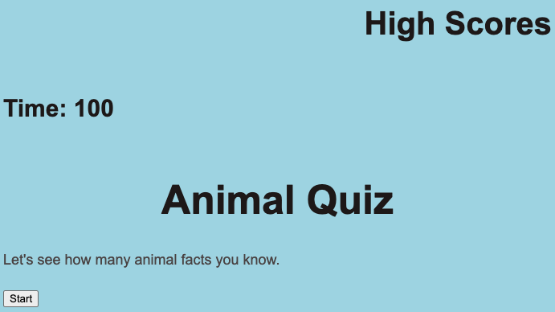

# Animal Quiz #

## Content: ##

- Created a quiz with HTML, CSS, and JavaScript
- Started the timer at 100 seconds and every wrong answer selected subtracts 10 seconds from the users time.
- The users score is saved to local storage after they enter their initials.

## Link: ##

https://amaraceresi.github.io/code-quiz/

